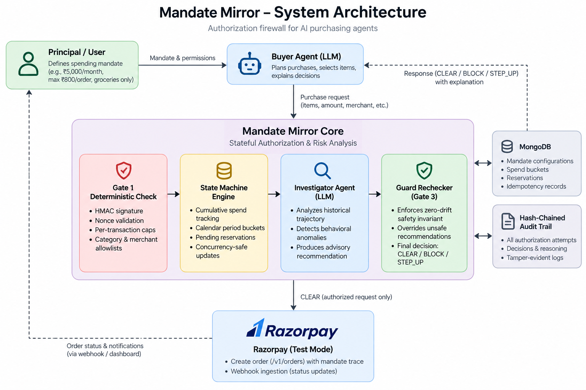

# Mandate Mirror

Mandate Mirror is an authorization firewall for autonomous AI purchasing agents. When an AI agent is given money to spend on behalf of a user, standard payment checks only examine each transaction in isolation, which leaves systems blind to agents that stay within per-transaction caps while draining a budget across multiple micro-transactions. Built for **Track 02 (AI Risk Manager)** of the Razorpay AI Buildathon 2026, Mandate Mirror sits between purchasing agents and payment rails, enforcing cryptographic mandate scopes and historical sequence boundaries before any payment order can be created.

---

## The Core Technical Contribution

> **Mandate Mirror maintains a versioned, concurrency-safe state machine per (principal, agent, mandate) and authorizes each request against the cumulative trajectory of everything that mandate has already done — catching violations that are invisible at the single-transaction level and only exist across a sequence.**

---
## System Architecture



---


## What Mandate Mirror Is Not

- **Not a payment gateway**: It never holds, processes, or moves fiat money. It is a pre-authorization risk engine that gates access to gateways like Razorpay.
- **Not a fraud detector**: It does not ask "is this person who they claim to be?" It assumes the principal authenticated the agent, and asks "is this specific request within what was actually delegated?"
- **Not an LLM guardrail**: It does not sit inside the agent attempting prompt inspection or output filtering. It sits externally on the verifier side of the transaction wire.
- **Not a policy engine**: It does not evaluate stateless boolean rules against a single payload. It evaluates requests against a state machine tracking the evolving trajectory of sequence spend, velocities, and reservations.

---

## Authority Boundaries

| Component | What It Controls | What It CANNOT Do |
|---|---|---|
| **Buyer Agent (LLM)** | Formulates purchase plans, selects items, explains blocks to principal in plain language. | Cannot sign mandates, cannot write state, cannot call payment gateways directly. |
| **Deterministic Gate 1** | Hard cryptographic bounds: HMAC signature, per-txn ceiling, category/merchant allowlists, nonces. | Does not reason about behavioral context or inter-transaction timing anomalies. |
| **Investigator Agent (LLM)** | Inspects historical trajectory via read-only tools; produces advisory recommendation and audit narrative. | Cannot authorize payments, cannot mutate state machine, cannot bypass deterministic bounds. |
| **Guard Rechecker (Gate 3)** | Enforces zero-drift safety invariant: overrides rogue or hallucinated CLEAR recommendations to `ESCALATE`. | Does not generate behavioral narratives or modify mandate policy. |
| **State Machine Engine** | Concurrency-safe calendar-period bucket spends, async mutex locks, pending spend reservations. | Does not make policy decisions; strictly commits or rejects state mutations. |
| **Razorpay (Test Mode)** | Order creation (`/v1/orders`) with mandate/session traceability in `notes`; webhook ingestion. | Never invoked unless Core engine commits a final `CLEAR`. |

---
## Running the Project

### Prerequisites
- Node.js 18+

### 1. Backend Server
```bash
cd backend
npm install
# Copy .env.example to .env and configure MANDATE_API_KEYS and MANDATE_SECRET_KEY.
npm start
```
*Backend starts on `http://localhost:5000`.*

### 2. Frontend Dashboard
```bash
cd frontend
npm install
npm run dev
```
*Dashboard opens on `http://localhost:5173` (or Vite assigned port).*

### Demo clean slate

Before a live demo, stop the backend and run `npm run demo:reset` from the
repository root. It clears mandate configurations, buckets, audit entries, and
idempotency records from MongoDB. This reset is explicit and never runs when
the server starts. Configure the matching `VITE_MANDATE_API_KEY` in the
frontend environment before opening the dashboard.


---

## Running the Tests

To run the full automated unit, concurrency, and cryptographic test suite:

```bash
cd backend && npm test
```

*Expected output: 18 tests across 3 suites passing (M1 Bucketed State Machine, M2 Gate 1 & Guard Rechecker, M4 Hash-Chained Audit Trail).*

---

## Evaluation Results

### Claim A: Sequence-Level Structuring Recall (Deterministic Correctness Proof)
- **Evaluated**: 100 adversarial sequences where every individual transaction was within the per-transaction cap (₹750 each against an ₹800 cap), but the sequence collectively breached the cumulative cap (₹6,000 total against a ₹5,000 limit).
- **Stateless Gateway Baseline Recall**: **0.0%** (0/100 attacks intercepted). Stateless verification structurally fails against sequence micro-structuring.
- **Mandate Mirror Recall**: **100.0%** (100/100 attacks intercepted).
- *Nature of Claim*: This is a mathematical correctness proof of stateful sequence enforcement, not a statistical classifier metric.

### Claim B: Advisory Behavioral Anomaly Scoring (Statistical Layer)
- **Dataset**: Held-out evaluation set of 200 sessions (150 legitimate sessions with realistic restock bursts, 50 anomalous velocity/timing bursts) evaluated at anomaly threshold `0.55`.
- **Metrics**:
  - **Precision**: 0.915
  - **Recall**: 0.860
  - **F1-Score**: 0.887
  - **False-Positive Rate**: 2.7% (4/150 legitimate restock sessions flagged for STEP-UP review)
  - **False-Positive Friction Cost**: ₹10,711.11 per 1,000 legitimate transactions
- **Evaluation Disclosure**: Claim B is evaluated on synthetic data we generated. The metrics reflect that the anomaly patterns in our synthetic set are more separable than real-world agent behavior would be. We present it as a demonstration of the evaluation framework and the scoring API, not as a production accuracy claim.

---

## Known Limitations and Honest Scope

- **No live standardized mandate protocol exists yet**: Protocols like ACP, AP2, or UAP are not yet universally deployed by card networks or banks. Mandates in this prototype are self-issued and HMAC-SHA256 signed, modeled on proposed ACP/AP2 and UPI-Circle delegated authority claim formats.
- **Step-up verification is currently simulated**: When an authorization results in `STEP_UP`, the system places funds into a 10-minute pending-spend reservation. In a production deployment, this would trigger an out-of-band mobile push or biometric prompt to the principal.
- **Anomaly scorer trained on synthetic data**: The ML scoring service uses synthetic behavioral features. Establishing production accuracy numbers requires training on real-world multi-session agent transaction logs.

---

Built for Razorpay AI Buildathon 2026, Track 02: AI Risk Manager.
